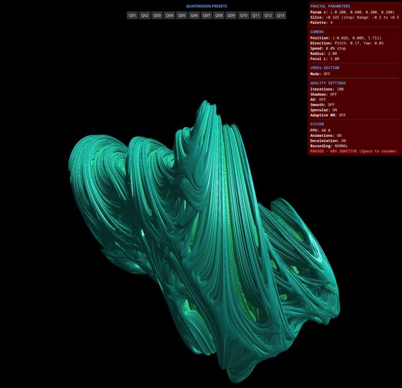

# Quaternion Julia Fractal Explorer


## Overview

An interactive 3D explorer for quaternion Julia fractals, allowing real-time navigation through stunning four-dimensional fractal structures. This application uses WebGL through Three.js to render complex quaternion fractals with high performance and implements advanced rendering techniques like adaptive ray marching, ambient occlusion, and smooth lighting.

## Features

- **Real-time 3D Rendering**: Explore quaternion Julia sets in a fully interactive 3D environment
- **Smooth Navigation**: Click on any point to smoothly travel to that location
- **Customizable Parameters**: Adjust fractal parameters, camera settings, and rendering quality in real-time
- **Cross-Section Modes**: Explore internal structures using different cross-section visualization techniques
- **Advanced Rendering**: Shadows, ambient occlusion, specular highlights, and adaptive ray marching
- **10 Color Palettes**: Choose from various color schemes or disable coloring
- **Video Recording**: Capture your exploration in WebM format with adjustable quality settings
- **4D Animation**: Animate the 4D slice parameter to observe how the fractal transforms across the fourth dimension
- **Tour System**: Record, save, and playback guided tours through fractal landscapes with smooth transitions

## Technical Details

- Implemented using Three.js and WebGL for high-performance rendering
- Uses quaternion mathematics to generate 4D fractals
- Fragment shader implements ray marching with distance estimation for rendering
- Responsive design adapts to different screen sizes

## Controls Guide

The application features a modern 3-panel interface system:
- **Main Controls Panel (Left)**: Complete fractal, rendering, and camera controls (toggle with 'G' key)
- **Parameters Monitor Panel (Right)**: Real-time system monitoring with performance graphs and parameter displays
- **Presets & Tours Panel (Top Center)**: Dropdown menus for quaternion presets (Q01-Q13), tour presets (T01-T04), and tour recording controls (collapsed by default)

### Legacy UI Verification
- Legacy panels available for comparison: 'M' (old controls), 'P' (old stats)
- All functionality has been moved to the modern Tweakpane interface
- Legacy panels are hidden by default for cleaner experience

### Navigation Controls
| Control | Action | Stats Panel Value |
|---------|--------|-------------------|
| Mouse click | Move view to clicked point | - |
| Mouse scroll | Move in viewing direction | "Velocity" |
| Middle mouse button | Hold to maintain constant velocity | "Velocity" |
| Arrow keys | Camera rotation in local axes | "Pitch", "Yaw" |
| Ctrl + Arrows | Faster rotation (5x) | "Pitch", "Yaw" |
| +/- | Zoom in/out (changes FOV) | "Focal length" |
| Space | Pause/resume rendering | Red "PAUSED" overlay |
| A | Toggle camera animations | "Animations: ON/OFF" |

### Fractal Parameters
| Control | Action | Stats Panel Value |
|---------|--------|-------------------|
| R | Reset fractal parameters | "c" parameter values |
| 0 | Toggle slice animation | "Slice", "Slice anim" |
| < / > | Decrease/increase slice amplitude | "Slice range" |
| 9 | Cycle through cross-section modes | "Cross-section" |
| [ / ] | Adjust cross-section distance | "CS Distance" |

### Rendering Quality
| Control | Action | Stats Panel Value |
|---------|--------|-------------------|
| 1 / 2 | Increase/decrease iteration count | "Iterations" |
| 3 | Toggle soft shadows | "Shadows: ON/OFF" |
| 4 | Toggle ambient occlusion | "AO: ON/OFF" |
| 5 | Toggle smooth coloring | "Smooth color: ON/OFF" |
| 6 | Cycle color palettes | "Color: OFF/1-10" |
| 7 | Toggle specular highlights | "Specular: ON/OFF" |
| 8 | Toggle adaptive ray marching | "Adaptive RM: ON/OFF" |

### Interface & Recording
| Control | Action | Stats Panel Value |
|---------|--------|-------------------|
| M | Show/hide legacy controls menu (verification) | - |
| P | Show/hide legacy stats panel (verification) | - |
| G | Toggle main Tweakpane controls panel | - |
| S | Take a screenshot of the fractal | - |
| V | Start/stop video recording | "REC" indicator when active |
| Q | Change recording quality | "Rec quality" |
| T | Open tour recording menu | - |
| Esc | Stop tour playback | - |

### Advanced Color Effects (Shift + Key Combinations)
| Control | Action | Stats Panel Value |
|---------|--------|-------------------|
| Shift + C | Toggle color animation | "Color anim: ON/OFF" |
| Shift + S | Increase color saturation (+Ctrl to decrease) | "Saturation" |
| Shift + B | Increase color brightness (+Ctrl to decrease) | "Brightness" |
| Shift + N | Increase color contrast (+Ctrl to decrease) | "Contrast" |
| Shift + P | Increase color phase shift (+Ctrl to decrease) | "Phase shift" |
| Shift + A | Increase color animation speed (+Ctrl to decrease) | "Anim speed" |

### Orbit Trap Effects (Shift + Key Combinations)
| Control | Action | Stats Panel Value |
|---------|--------|-------------------|
| Shift + O | Toggle orbit trap effects | "Orbit trap: ON/OFF" |
| Shift + T | Cycle orbit trap types | "Trap type" |
| Shift + R | Increase orbit trap radius (+Ctrl to decrease) | "Trap radius" |
| Shift + I | Increase orbit trap intensity (+Ctrl to decrease) | "Trap intensity" |

### Physics-Based Coloring (Shift + Key Combinations)
| Control | Action | Stats Panel Value |
|---------|--------|-------------------|
| Shift + F | Toggle physics-based coloring | "Physics color: ON/OFF" |
| Shift + Y | Cycle physics color types | "Physics type" |
| Shift + Q | Increase physics frequency (+Ctrl to decrease) | "Physics freq" |
| Shift + W | Increase physics waves (+Ctrl to decrease) | "Physics waves" |
| Shift + E | Increase physics intensity (+Ctrl to decrease) | "Physics intensity" |
| Shift + D | Increase physics balance (+Ctrl to decrease) | "Physics balance" |

### Quick Access Shortcuts
| Control | Action | Notes |
|---------|--------|-------|
| O | Toggle orbit trap (quick access) | Same as Shift + O |
| F | Toggle physics color (quick access) | Same as Shift + F |
| C | Toggle color animation (quick access) | Same as Shift + C |

## Statistics Panel Sections

The right-side stats panel displays the current state of the application in several categories:

### FRACTAL PARAMETERS
- Current quaternion Julia set parameter values (c.x, c.y, c.z, c.w)
- Current 4D slice value and animation state

### CAMERA
- Position (x, y, z) and orientation (pitch, yaw)
- Movement velocity and focal length

### CROSS-SECTION
- Current cross-section mode and distance
- Only active when cross-section mode is enabled (9 key)

### QUALITY SETTINGS
- Iteration count
- Status of various rendering features (shadows, AO, etc.)
- Current color palette

### SYSTEM
- Frames per second (FPS)
- Recording status and quality

## Techniques Used

The application uses several advanced rendering techniques:

1. **Ray Marching**: A rendering technique where rays are incrementally stepped through the scene until they hit a surface
2. **Distance Estimation**: Mathematical formulas that calculate the distance to the fractal surface
3. **Adaptive Ray Marching**: Dynamically adjusts step size based on distance to surface (smaller steps near surfaces for precision, larger steps in empty spaces for performance)
4. **Ambient Occlusion**: Simulates how light is occluded by nearby surfaces, adding realism and depth
5. **Quaternion Mathematics**: 4D extension of complex numbers, enabling the generation of four-dimensional fractals

## Installation & Setup

No complex installation process is required! Simply follow these steps:

1. **Clone or download the repository**
   ```
   git clone https://github.com/your-username/quaternion-julia-fractal-explorer.git
   ```
   Or download and extract the ZIP file

2. **Local server setup (optional but recommended)**
   - For best performance and to avoid CORS issues, serve the files using a local web server
   - If you have Python installed:
     ```
     # Python 3
     python -m http.server
     
     # Python 2
     python -m SimpleHTTPServer
     ```
   - Or use any other local development server (Node.js http-server, PHP built-in server, etc.)

3. **Open in browser**
   - If using a local server, navigate to `http://localhost:8000` (or the port your server uses)
   - Alternatively, simply open the `index.html` file directly in your browser

### System Requirements

- **Browser**: Modern web browser with WebGL 2.0 support (Chrome, Firefox, Edge, Safari)
- **GPU**: NVIDIA RTX 4060 or equivalent/better recommended for optimal performance
   - For the best experience with advanced rendering features (shadows, AO, etc.)
   - Older GPUs may work but with reduced performance, especially at higher resolutions
- **CPU**: Any modern multi-core processor (4+ cores recommended)
- **RAM**: 8GB minimum, 16GB recommended
- **Storage**: Less than 1MB (no additional installation required)
- **Network**: Not required (runs completely offline)

## Examples of Exploration

- Try pressing '0' to animate the 4D slice parameter and observe how the fractal transforms
- Use '9' key to enable cross-sections and explore the internal structure
- Toggle different rendering features (keys 3-8) to see their impact on visual quality
- Experiment with different color palettes using the '6' key
- Press 'T' to open the tour recording menu and create your own guided tour

## Advanced Features Guide

### Dynamic Color Effects
The application includes sophisticated color manipulation beyond basic palettes:

- **Color Animation** (Shift + C): Animates colors through the spectrum over time
- **Saturation Control** (Shift + S): Adjusts color intensity from grayscale to vivid
- **Brightness Control** (Shift + B): Controls overall color brightness
- **Contrast Control** (Shift + N): Adjusts color contrast for dramatic effects
- **Phase Shift** (Shift + P): Rotates colors through the spectrum
- **Animation Speed** (Shift + A): Controls how fast color animations cycle

### Orbit Trap Visualization
Orbit traps create stunning geometric patterns by tracking how fractal iterations interact with shapes:

- **Toggle Orbit Traps** (Shift + O or O): Enable psychedelic geometric coloring
- **Trap Types** (Shift + T): Cycle through circle, line, point, and cross patterns
- **Trap Radius** (Shift + R): Size of the geometric trap shape
- **Trap Intensity** (Shift + I): How strongly the trap affects the coloring

### Physics-Based Coloring
Advanced coloring that simulates optical phenomena:

- **Toggle Physics Color** (Shift + F or F): Enable physics-based color effects
- **Physics Types** (Shift + Y): Switch between diffraction, interference, and emission spectrum effects
- **Frequency** (Shift + Q): Controls the wavelength of optical effects
- **Wave Count** (Shift + W): Number of interference waves
- **Intensity** (Shift + E): Strength of the physics effect
- **Balance** (Shift + D): Blend between different physics models

### Pro Tips for Advanced Features
- Use **Ctrl + Shift + Key** to decrease values instead of increase
- Combine different effects: try orbit traps with physics-based coloring
- Advanced effects work best with smooth coloring enabled (key '5')
- Use the advanced controls panel (G key) for precise numeric adjustments

## Modern UI Features

The application has been completely redesigned with a professional 3-panel interface:

### 3-Panel Layout System
- **Main Controls (Left)**: All fractal parameters, rendering settings, and camera controls
- **Parameters Monitor (Right)**: Real-time system monitoring with performance graphs
- **Presets & Tours (Top Center)**: Quick access to presets and tour functionality

### Dropdown Context Menus
- **Quaternion Presets**: Click "▼ Select Quaternion Preset" to choose from Q01-Q13 configurations
- **Tour Presets**: Click "▼ Select Tour" to choose from T01-T04 pre-recorded tours
- **Full-Width Design**: All controls efficiently use the complete panel width
- **Smooth Navigation**: Menus reset automatically after selection

### Enhanced User Experience
- **Scroll Isolation**: Panel scrolling doesn't interfere with fractal navigation
- **Legacy Verification**: Old UI panels available for comparison (M/P keys)
- **Responsive Design**: Interface adapts to different screen sizes
- **Real-Time Monitoring**: Live FPS graphs and parameter tracking

### Performance Features
- **Smart Event Handling**: Scroll events are blocked on UI panels to prevent conflicts
- **Efficient State Management**: UI changes sync instantly across all panels
- **Memory Optimization**: Clean resource management and efficient rendering

## Tour System

The application includes a comprehensive tour recording and playback system:

1. **Recording Tours**:
   - Use the "Tour System" section in the "Presets & Tours" panel
   - Click "🎬 Start Tour Recording (T)" to begin recording
   - Navigate to interesting locations and click "📍 Register Point" to add waypoints
   - Click "✅ Finish Tour" to save your tour as a JSON file

2. **Playing Tours**:
   - Pre-recorded tours are available in the "Presets & Tours" panel (top center)
   - Click "▼ Select Tour" dropdown to choose from T01-T04 tours
   - Select a tour to start playback with smooth transitions between points
   - All fractal settings, camera positions, and render settings are preserved
   - Press 'Esc' at any time to stop playback

3. **Tour Components**:
   - Each tour consists of multiple points with complete state information
   - Smooth transitions between points are automatically calculated
   - Camera paths follow natural movement trajectories

For more details about the tour system, see the [TOUR.md](TOUR.md) documentation file.

## Gallery

<table>
<tr>
<td></td>
<td></td>
<td></td>
</tr>
<tr>
<td></td>
<td></td>
<td></td>
</tr>
<tr>
<td></td>
<td></td>
<td></td>
</tr>
</table>

## Constant Velocity Movement

The application features a specialized movement control that lets you maintain a constant velocity:

1. **How it works**:
   - Use the mouse wheel to accelerate to your desired speed
   - Hold down the middle mouse button (wheel click)
   - While held, the velocity remains constant with no deceleration
   - Release the middle button to return to normal movement physics with deceleration

2. **Benefits**:
   - Perfect for creating smooth camera paths for recordings
   - Allows precise exploration of complex structures
   - Combines well with camera rotation to create orbital movements
   - Particularly useful for long-distance travel through the fractal

This feature overcomes a common issue in 3D exploration where maintaining a consistent speed is difficult. By locking your velocity while the middle button is held, you can focus on steering rather than constantly adjusting your speed.

## Performance Tips

- If experiencing low frame rates, reduce iterations (press '2')
- Disabling ambient occlusion (key '4') can significantly improve performance
- Enabling adaptive ray marching (key '8') improves performance in complex scenes

## License

This project is released under the MIT License.

## Acknowledgments

- Three.js for the WebGL rendering framework
- The fractal mathematics community for algorithms and inspiration
